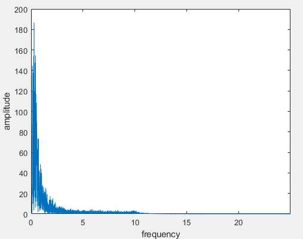

# qREST库说明

***Version1.0.20240807***

本次共封装出两个库文件：`edp_library`，用于计算工程需求参量（层间位移角）和`gmp_library`，用于计算地震动参数（反应谱、Fourier谱）。库使用`Cpp`编写，接口为`C`。生成动态库的编译器环境为MSVC 14.40。

## 文件目录

- `bin`目录：`dll`动态库目录，存放编译完成的动态库文件。其中`gmp_library`和`edp_library`为编译生成的`dll`库文件，其他为用到的第三方库。
- `include`目录：动态库头文件目录，存放动态库接口说明的`.h`头文件。
- `resource`目录：资源文件，存放计算输入和输出文件。
- `example`目录：测试动态库的源码文件，使用`Cpp`编写了几个简单的函数，测试动态库的可行性与计算准确性。经测试，提供的动态库计算没有问题。
- `image`目录：`readme`配套的图片资源文件。

## 接口说明

### `gmp_library`计算模块

`gmp_library`提供了地震动参数计算模块，包含1个结构体和5个函数：

- `struct ResponseSpectrum`：储存反应谱计算结果的结构体，包含5个成员变量：
  `Sa`、`Sv`和`Sd`分别储存加速度谱、速度谱和位移谱的计算结果；
  `result_size`表示三种谱对应数组的长度（当前版本固定为500）；
  `dt`表示反应谱的横轴刻度大小（当前版本固定为0.01）。

- `GetResponseSpectrum`：计算反应谱的函数。函数接收4个参数：
  `acceleration`：输入加速度的一维数组；
  `size`：输入加速度数组的长度；
  `frequency`：输入加速度的采样频率；
  `damping_ratio`：计算反应谱选取的阻尼比。
  返回`struct ResponseSpectrum`结构体表示计算结果。

- `GetPseudoResponseSpectrum`：计算拟反应谱的函数。函数接收4个参数：
  `acceleration`：输入加速度的一维数组；
  `size`：输入加速度数组的长度；
  `frequency`：输入加速度的采样频率；
  `damping_ratio`：计算反应谱选取的阻尼比。
  返回`struct ResponseSpectrum`结构体表示计算结果。

- `FourierSpectrum`：计算Fourier幅值谱的函数。函数接收两个参数：
  `acceleration`：输入加速度的一维数组；
  `size`：输入加速度数组的长度。
  返回一个`double`数组储存Fourier变换后的幅值谱结果，数组长度和输入数组相同。

- `FreeResponseSpectrum`：释放反应谱结果的内存。函数接收一个参数：
  `memory`：反应谱结果。
  无返回值。

- `FreeArray`：释放一维数组的内存。函数接收一个参数：
  `memory`：一维数组（指针）
  无返回值。

### `edp_library`计算模块

`edp_library`提供了工程需求参量计算模块，包含3个结构体和5个函数：

- `struct Idr`：层间位移角计算结果，储存了所有楼层的层间位移角时程，是较大的矩阵数据。包含了三个成员变量：
  `idr`：二维数组（指针），储存所有楼层的层间位移角时程，每个子指针存放一个楼层的层间位移时程，数组大小为`double[story_count][time_step_count]`；
  `story_count`：楼层总数，`idr`数组的第一维大小；
  `time_step_count`：时间节点数，`idr`数组的第二维大小。

- `struct Building`：建筑信息结构体，用于存放测点高度坐标和各楼层的高度坐标，包含4个成员变量：
  `floor_height`：楼层高度坐标，长度为`floor_count`的一维数组；
  `floor_count`：楼层高度坐标的尺寸；
  `measure_point_height`：测点高度坐标，长度为`measure_point_count`的一维数组；
  `measure_point_count`：`measure_point_height`的尺寸。

- `struct MaxIdr`：最大层间位移角计算结果，包含三个成员变量：
  `max_idr`：所有层最大层间位移角的计算结果，长度为`story_count`的一维数组；
  `max_idr_time`：各层最大层间位移角对应的相对时间（s），长度为`story_count`的一维数组；
  `story_count`：`max_idr`和`max_idr_time`的尺寸大小；
  `max_idr_story`：`max_idr`中的最大值对应的楼层坐标，`max_idr[max_idr_story`表示所有层所有时刻的最大层间位移角值，`max_idr_time[max_idr_story]`表示最大层间位移角出现的相对时间。

- `FilteringIntegral`：滤波积分法计算层间位移角的算法函数。接收4个参数：
  `input_acceleration`：输入的加速度二维数组，每个子数组存放一个楼层的层间位移时程，数组大小为大小为`double[building->measure_point_count][time_step_count]`；
  `time_step_count`：输入加速度的采样数，`input_acceleration`每个子数组的长度，在函数中该值会被赋给`struct Idr.time_step_count`；
  `frequency`：输入加速度的采样频率；
  `building`：计算需要的建筑信息，`struct Building`类型的结构体。
  返回一个`struct Idr`表示层间位移角时程结果。

- `ModifiedFilteringIntegral`：改进的滤波积分法计算层间位移角的算法函数（参数和返回值同`FilteringIntegral`）。接收4个参数：
  `input_acceleration`：输入的加速度二维数组，每个子数组存放一个楼层的层间位移时程，数组大小为大小为`double[building->measure_point_count][time_step_count]`；
  `time_step_count`：输入加速度的采样数，`input_acceleration`每个子数组的长度，在函数中该值会被赋给`struct Idr.time_step_count`；
  `frequency`：输入加速度的采样频率；
  `building`：计算需要的建筑信息，`struct Building`类型的结构体。
  返回一个`struct Idr`表示层间位移角时程结果。

- `GetMaxIdr`：根据层间位移角计算结果计算最大层间位移角。接收两个参数：
  `idr_result`：层间位移角计算结果，`struct Idr`结构体；
  `frequency`：计算`idr_result`时输入加速度的采样频率。
  返回一个`struct MaxIdr`，储存最大层间位移角结果。

- `FreeIdr`：释放层间位移角计算结果的内存。函数接收一个参数：
  `memory`：层间位移角计算结果，`struct Idr`结构体。
  无返回值。

- `FreeMaxIdr`：释放最大层间位移角的计算结果。接收一个参数：
  `memory`：最大层间位移角结果，`struct MaxIdr`结构体。
  无返回值。

## 图形绘制

根据上述两个库中的函数，可以实现几种图像的绘制。

### 加速度时程图形

- 加速度时程图形：读取信号文件后，可以得到所有测点记录到的加速度数值，结合采样频率或者信号时间戳可以绘制出加速度信号的时程曲线。横轴为横轴为时间，间隔为采样频率的倒数`1/frequency`。纵轴为输入加速度的大小。

### `gmp_library`图形

- 反应谱图像：反应谱计算结果（包含拟反应谱）可以绘制给定加速度的反应谱图像。反应谱图像横轴为步长`struct ResponseSpectrum.dt`、长度`struct ResponseSpectrum.result_size`的数组。（这里默认为0.01*500），即横轴为0-5s的时间轴，表示反应谱的周期。反应谱图像纵轴为反应谱计算结果，数值由`struct ResponseSpectrum.Sa/Sv/Sd`提供。三种反应谱应绘制在不同图像中。反应谱绘制结果如下图：
  
  
  

- Fourier谱图像：Fourier谱计算结果的图像。横轴为频率，刻度为输入加速度的采样频率`frequency`/加速度采样数`time_step_count`，长度一般取计算结果数组长度的一半。纵轴为Fourier谱计算结果，由函数返回的数组提供。Fourier谱绘制结果如下图：
  

### `edp_library`图形

- 最大层间位移角分布图形：根据`GetMaxIdr`函数计算得到的最大层间位移角分布绘制的阶梯图。横轴为最大层间位移角结果，一维数组，由`GetMaxIdr`函数返回值结构体的成员变量`struct MaxIdr.max_idr`提供，数组长度由`GetMaxIdr`函数返回值结构体的成员变量`struct MaxIdr.story_count`提供。纵轴为建筑楼层高度，由结构体`struct Building.floor_height`提供（从第2项至末项），数组长度为`struct Building.floor_count - 1`。最大层间位移角图形如下：
  
  （阶梯图如不方便绘制，可先绘制折线图）

- 单个楼层层间位移角时程图形：根据`ModifiedFilteringIntegral`或者`FilteringIntegral`可以计算得到所有层层间位移角的时程，结果以二维数组的形式打包在结构体`Idr`中，`Idr.idr[i]`可以获取第`i`层的层间位移角时程。由此所有楼层的层间位移角时程都是可以绘制的，绘制的形式类似于加速度的时程图。纵轴为`Idr.idr[i]`，表示第`[i]`层的层间位移角大小，数组长度为`Idr.time_step_count`。横轴为时间，间隔为采样频率的倒数`1/frequency`。结果如下：
  

- 所有楼层层间位移角分布图：类似于最大层间位移角分布图，每一时刻都可以绘制出层间位移角的分布图形，随时刻变化，可以得到层间位移角的动态时程，即可变的层间位移角时程图。横轴数据由`Idr.idr[][j]`获取，即对`Idr.idr`数组的每一个子数组取第`[j]`个元素表示在第`[j]`个时间点（即`j/frequency`时刻）所有楼层的层间位移角分布图。纵轴为建筑楼层高度，由结构体`struct Building.floor_height`提供（从第2项至末项），数组长度为`struct Building.floor_count - 1`。
  
